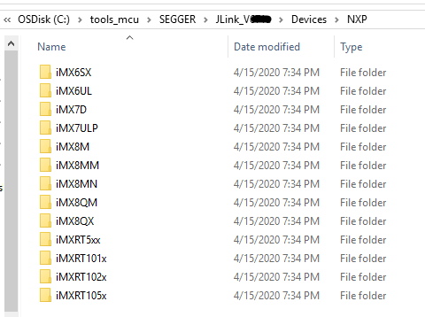
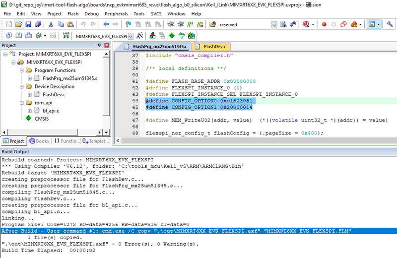
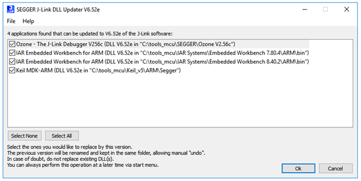
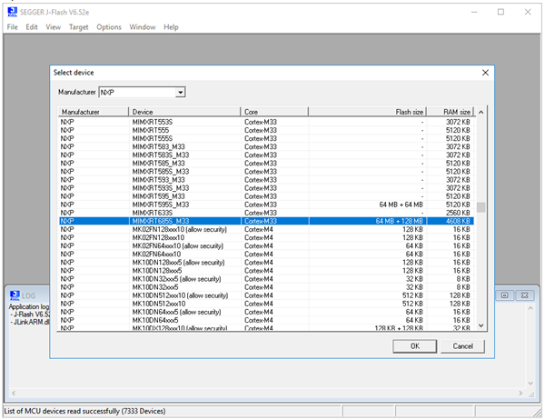
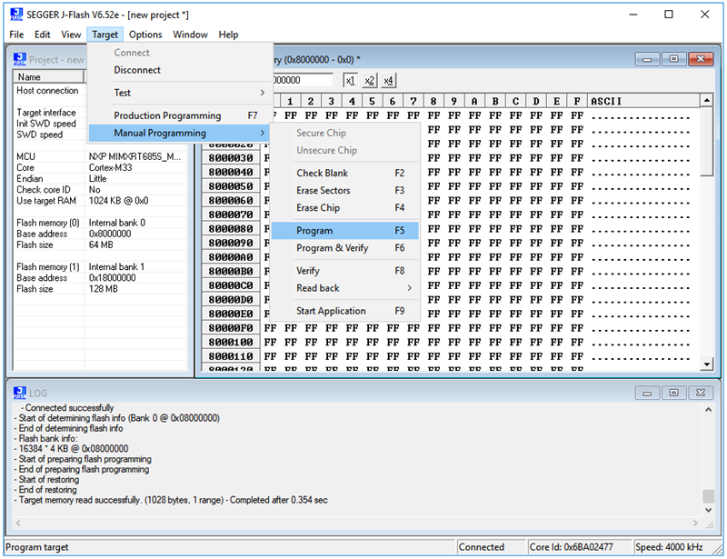

# imxrt-tool-flash-algo
Build tool (IAR, Keil, J-Link) flash algo for i.MXRT | 收集i.MXRT主流开发工具的flash算法源工程

> * IAR EWARM v8.40.2  
> * Keil MDK v5.27  
> * J-Link v6.52e  
> * MCUXpresso IDE v11.0.0_2495_alpha  

<table><tbody>
    <tr>
        <th>RT</th>
        <th>IDE</th>
        <th>Board</th>
        <th>Flash</th>
        <th>Port</th>
        <th>Status</th>
    </tr>
    <tr>
        <td rowspan="4">i.MXRT500<br>
                        A0/B0</td>
        <td>IAR</td>
        <td>/</td>
        <td>/</td>
        <td>/</td>
        <td>/</td>
    </tr>
    <tr>
        <td rowspan="2">Keil<br>
                        J-Link</td>
        <td>NXP EVK_Rev.C</td>
        <td>U38<br>
            MX25UM51345</td>
        <td>PIO1[27:20]<br>
            FLEXSPI0_PortA</td>
        <td>Done<br>
            Not for J-Flash</td>
    </tr>
    <tr>
        <td>HMI xProject_V1</td>
        <td>GD25LE128</td>
        <td>PIO1[23:20]<br>
            FLEXSPI0_PortA</td>
        <td></td>
    </tr>
    <tr>
        <td>MCUX</td>
        <td>/</td>
        <td>/</td>
        <td>/</td>
        <td>/</td>
    </tr>
    <tr>
        <td rowspan="5">i.MXRT600<br>
                        A0</td>
        <td>IAR</td>
        <td>/</td>
        <td>/</td>
        <td>/</td>
        <td>/</td>
    </tr>
    <tr>
        <td rowspan="3">Keil<br>
                        J-Link</td>
        <td>NXP EVB_Rev.0</td>
        <td>U8<br>
            W25Q64FW</td>
        <td>PIO1[23:20]<br>
            QSPI_PortA</td>
        <td>Done</td>
    </tr>
    <tr>
        <td>NXP EVK_Rev.B</td>
        <td>U19<br>
            MX25UM51345</td>
        <td>PIO1[27:20]<br>
            QSPI_PortA</td>
        <td>/</td>
    </tr>
    <tr>
        <td>MSFT xProject_V1</td>
        <td>W25Q16FW<br>
            (no SFDP)</td>
        <td>PIO1[23:20]<br>
            QSPI_PortA</td>
        <td>Done</td>
    </tr>
    <tr>
        <td>MCUX</td>
        <td>/</td>
        <td>/</td>
        <td>/</td>
        <td>/</td>
    </tr>
    <tr>
        <td rowspan="5">i.MXRT600<br>
                        B0</td>
        <td>IAR</td>
        <td>/</td>
        <td>/</td>
        <td>/</td>
        <td>/</td>
    </tr>
    <tr>
        <td rowspan="3">Keil<br>
                        J-Link</td>
        <td>NXP EVB_Rev.C</td>
        <td>/</td>
        <td>/</td>
        <td>/</td>
    </tr>
    <tr>
        <td>NXP EVK_Rev.E</td>
        <td>U19<br>
            MX25UM51345</td>
        <td>PIO1[14:11],PIO2[23:22,18:17]<br>
            FLEXSPI_PortB</td>
        <td>Done</td>
    </tr>
    <tr>
        <td>MSFT xProject_V2</td>
        <td>W25Q16FW<br>
            (no SFDP)</td>
        <td>PIO1[23:20]<br>
            FLEXSPI_PortA</td>
        <td>Done</td>
    </tr>
    <tr>
        <td>MCUX</td>
        <td>/</td>
        <td>/</td>
        <td>/</td>
        <td>/</td>
    </tr>
    <tr>
        <td rowspan="3">i.MXRT1050</td>
        <td>IAR</td>
        <td>/</td>
        <td>/</td>
        <td>/</td>
        <td>/</td>
    </tr>
    <tr>
        <td rowspan="1">Keil<br>
                        J-Link</td>
        <td>NXP EVKB_Rev.A1</td>
        <td>U19<br>
            S26KS512S</td>
        <td>GPIO_SD_B1[11:08,03:00]<br>
            FLEXSPI_PortA&B</td>
        <td>Done</td>
    </tr>
    <tr>
        <td>MCUX</td>
        <td>/</td>
        <td>/</td>
        <td>/</td>
        <td>/</td>
    </tr>
    <tr>
        <td rowspan="5">i.MXRT1060</td>
        <td>IAR</td>
        <td>/</td>
        <td>/</td>
        <td>/</td>
        <td>/</td>
    </tr>
    <tr>
        <td rowspan="3">Keil<br>
                        J-Link</td>
        <td>NXP EVK_Rev.A1</td>
        <td>U33<br>
            IS25WP064</td>
        <td>GPIO_SD_B1[11:08]<br>
            FLEXSPI_PortA</td>
        <td>Done</td>
    </tr>
    <tr>
        <td>HON xProject_V1<br>
            HON xProject_V2</td>
        <td>IS25WP512<br>
            IS25LP256</td>
        <td>GPIO_SD_B1[11:08]<br>
            FLEXSPI_PortA</td>
        <td>Done</td>
    </tr>
    <tr>
        <td>HON yProject_V1</td>
        <td>IS25LP064</td>
        <td>GPIO_AD_B1[13:10]<br>
            FLEXSPI_PortA</td>
        <td>Done</td>
    </tr>
    <tr>
        <td>MCUX</td>
        <td>/</td>
        <td>/</td>
        <td>/</td>
        <td>/</td>
    </tr>
</table>

### 一、用于Segger J-Link
#### 1.1 安装Segger J-Link驱动
想正常使用 J-Link 仿真器，首先需要在 Segger 官网下载并安装 J-Link 驱动：

> * 下载地址：https://www.segger.com/downloads/jlink/
> * 正常工作版本： v6.52e
> * 异常工作版本： v6.71a（不确定新版J-Link做了什么变化，待研究）

#### 1.2 确定MCU型号在J-Link支持列表里
以 i.MXRT600 芯片为例，进入 J-Link 安装目录，找到 \SEGGER\JLink_Vxxx\Devices\NXP\ 路径查看是否有 i.MXRT600 的支持，很遗憾，没有发现 i.MXRT600 的踪影，因为 i.MXRT600 型号比较新，还没有被 J-Link 官方支持。



所以我们需要为 J-Link 增加 i.MXRT600 的支持。将本项目中提供的 i.MXRT600 芯片支持包解压，将包中的 \JLink_V652\Devices\NXP\iMXRT6xx 文件夹拷贝到上图路径下：

> * i.MXRT600 芯片支持包：[\imxrt-tool-flash-algo\packs\RT600_b0_segger_patch_1210.zip](packs/RT600_b0_segger_patch_1210.zip)


最后需要将如下代码添加到 \SEGGER\JLink_Vxxx\JLinkDevices.xml 文件中，JLinkDevices.xml 文件主要用于告诉 J-Link 仿真器 i.MXRT600 的 flash 算法文件位置在哪里。至此，i.MXRT600 的初步支持已经加到 J-Link 中。

```XML
  <Device>
    <ChipInfo Vendor="NXP" Name="MIMXRT685S_M33" WorkRAMAddr="0x00000000" WorkRAMSize="0x00480000" Core="JLINK_CORE_CORTEX_M33" JLinkScriptFile="Devices/NXP/iMXRT6xx/iMXRT6xx_CortexM33.JLinkScript"/>
    <FlashBankInfo Name="FLEXSPI flash" BaseAddr="0x08000000" MaxSize="0x08000000" Loader="Devices/NXP/iMXRT6xx/MIMXRT6XX_EVK_FLEXSPI.FLM" LoaderType="FLASH_ALGO_TYPE_OPEN" />
    <FlashBankInfo Name="Secure OSPI flash Secure" BaseAddr="0x18000000" MaxSize="0x08000000" Loader="Devices/NXP/iMXRT6xx/MIMXRT6XX_EVK_FLEXSPI_S.FLM" LoaderType="FLASH_ALGO_TYPE_OPEN" />
  </Device>
  <Device>
    <ChipInfo Vendor="NXP" Name="MIMXRT633S" WorkRAMAddr="0x00000000" WorkRAMSize="0x00280000" Core="JLINK_CORE_CORTEX_M33"/>
  </Device>
```

#### 1.3 生成flash算法文件
以 i.MXRT600-EVK (Rev.E) 官方开发板为例，使用 Keil MDK (v5.27及以上) 打开 flash 算法工程，这个工程里的默认 flash 配置适用于 EVK 上 Flash 型号以及连法（关于 RT600 的 flash 连法可参考文章 [《FlexSPI NOR连接方式大全(RT600)》](https://www.cnblogs.com/henjay724/p/12436962.html) ）。

> * i.MXRT600 算法工程：[\imxrt-tool-flash-algo\boards\nxp_evkmimxrt685_rev.e\flash_algo_b0_silicon\Keil_JLink\MIMXRT6XX_EVK_FLEXSPI.uvprojx](boards/nxp_evkmimxrt685_rev.e/flash_algo_b0_silicon/Keil_JLink/MIMXRT6XX_EVK_FLEXSPI.uvprojx)

如果是其他型号 Flash 或连法，一般只需要更改 FlashPrg_mx25um51345.c 文件里的 CONFIG_OPTION0 和 CONFIG_OPTION1 的值即可。关于这两个值的定义，参考芯片手册里的BootROM章节，因为 i.MXRT600 支持 ROM API，这里的 flash 算法工程是基于 ROM API 实现的。



工程成功编译后，会生成 MIMXRT6XX_EVK_FLEXSPI.FLM，这个文件就是我们要的算法文件，其实它就是.axf文件改了个文件类型。你可以手工地将新生成的 .FLM 改个名字（当然最好在 Keil 工程里改名）。


#### 1.4 使用新生成的flash算法文件
有了新生成的 MIMXRT6XX_EVK_FLEXSPI.FLM，将其放到 \SEGGER\JLink_Vxxx\Devices\NXP\iMXRT6xx 目录下，并且注意修改 \SEGGER\JLink_Vxxx\JLinkDevices.xml 文件中的 **Loader="Devices/NXP/iMXRT6xx/MIMXRT6XX_EVK_FLEXSPI.FLM"** 语句（如果你改了.FLM文件名的话）。


为了让 i.MXRT600 芯片支持包和新 flash 算法生效，最好双击运行一下 \SEGGER\JLink_Vxxx\JLinkDLLUpdater.exe。



#### 1.5 J-Flash使用示例
至此我们就可以在 J-Link 下正常下载 i.MXRT600-EVK 上的 flash 了，以 J-Link 配套的 flash 烧写工具 J-Flash 为例。打开 \SEGGER\JLink_Vxxx\JFlash.exe 软件，选择目标芯片为 **MiMXRT685S_M33**。



然后，将 i.MXRT600-EVK 设为 Serial ISP 模式（SW5[2:1]设为Off-Off-On）并通电，连接上后便可以任意读写擦 flash 了。



### 二、用于IAR EWARM


### 三、用于Keil MDK

### 四、用于MCUXpresso IDE
